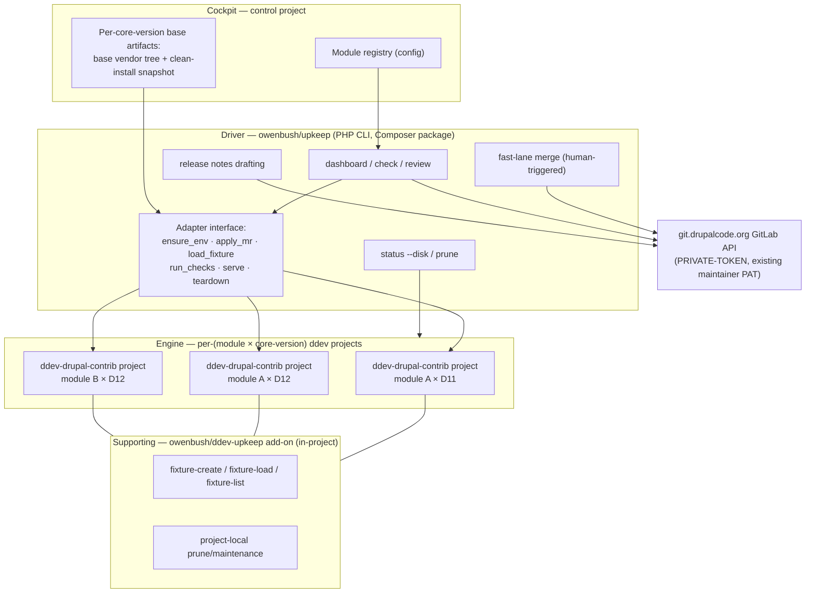
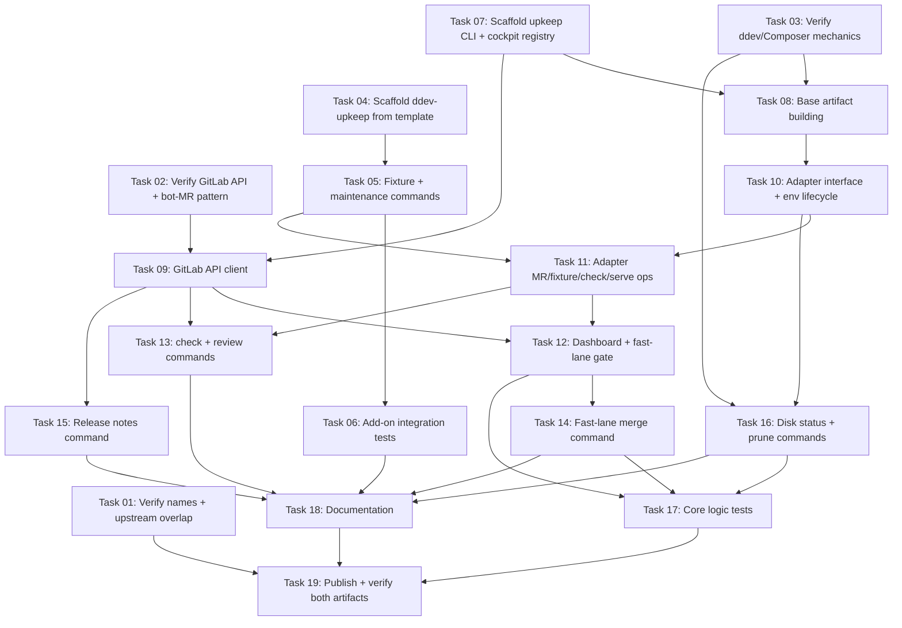

# Plan: Build and Publish Upkeep v1 — Drupal Contrib Maintainer Workbench

## Original Work Order

> Inside docs there is a markdown file describing a project I want to build. This is from scratch. Nothing exists yet, not even a repo. Analyze the doc and build out the plan

The referenced document is `docs/contrib-maintainer-design.md` ("Upkeep — Design Document, *A contrib maintainer's workbench for Drupal*"), a consensus-stage design covering the architecture, command surface, build sequence, and open questions for the tool. That document is the authoritative source of design intent for this plan.

## Plan Clarifications

| # | Question | Answer |
|---|----------|--------|
| 1 | Should this plan cover the entire v1 build or only an initial slice of the 5-stage build sequence? | **Entire v1** — all five build-sequence stages in one plan. |
| 2 | How should the two distributable artifacts be organized on disk? | **Two repos** — this directory becomes the `owenbush/upkeep` orchestrator repo; the ddev add-on gets its own sibling repo, scaffolded from the official `ddev/ddev-addon-template` GitHub template. |
| 3 | Are the design doc's section-13 open-question verifications in scope? | **Yes, in scope** — an explicit early verification effort resolves them before or alongside dependent build work. |
| 4 | Does the plan end at release-ready code or actual publication? | **Publish** — public GitHub repos, Packagist registration, initial tags; `composer global require owenbush/upkeep` and `ddev add-on get` must work for real. |
| 5 | Are there any backwards-compatibility obligations? | **Confirmed: none.** Greenfield build with no legacy interfaces, data formats, or workflows to preserve. |
| 6 | What is the companion ddev add-on called? | **`ddev-upkeep`** — repo `owenbush/ddev-upkeep`, following ddev naming convention, subject to the same namespace-collision check as the orchestrator. |

## Executive Summary

This plan builds **Upkeep** from nothing to two published, installable artifacts: the `upkeep` orchestrator — a PHP CLI distributed as the Composer package `owenbush/upkeep` — and a companion ddev add-on, `owenbush/ddev-upkeep`, providing in-project fixture and maintenance commands. Together they give a maintainer of many Drupal contrib modules one place to see every open merge request across all maintained modules, test any MR in an isolated per-(module × core-version) environment, drop an MR onto a live site for manual review, merge trusted compatibility MRs with a single human-approved action each, and draft release notes.

The approach follows the design doc's central principle: isolate each axis with the cheapest mechanism that works. Database state is isolated via snapshot-backed fixtures; codebase, Composer dependency tree, and PHP version are isolated via a separate on-disk project per (module × core-version); container services are shared images recreated cheaply per project. The existing `ddev-drupal-contrib` add-on is reused wholesale as the testing engine — the orchestrator drives it only through a thin, swappable adapter interface, so churn in the engine or a future rig change is absorbed in one place. Cold starts are made fast with per-core-version base artifacts: a resolved base vendor tree and a clean-install DB snapshot, both built once and reused.

The plan deliberately front-loads verification of the design doc's open questions — most critically, which git.drupalcode.org GitLab API endpoints are actually open to Personal Access Tokens, and whether `owenbush/upkeep` is free on Packagist — because these can reshape the fast-lane and distribution work. The v1 fast lane is strictly human-triggered (one approved merge per keypress), which complies with the Drupal Association's PAT/automation policy without requiring approval. The outcome is a stack that feels native to a Drupal maintainer: the orchestrator ships like Drush, the add-on ships like any ddev add-on, and no foreign toolchain is required.

## Context

### Current State vs Target State

| Current State | Target State | Why? |
|---------------|--------------|------|
| Nothing exists: no repos, no code, only the design document | Two public repos (`owenbush/upkeep`, `owenbush/ddev-upkeep`) with tagged initial releases | The tool must exist and be installable to deliver any value |
| MR status is checked module-by-module in the GitLab web UI | `upkeep dashboard` shows all open MRs across all maintained modules and core versions with CI + local check status | Eliminates the highest-frequency manual chore and gives one place to decide what to act on |
| Testing an MR means hand-building an environment per attempt | `upkeep check` provisions an isolated per-(module × core-version) project, applies the MR, and runs CI-aligned checks | Fast, trustworthy, cross-version-correct verification with no cross-contamination |
| New environments require a full Composer resolve and site install | Cold starts seed from a per-core-version base vendor tree and restore a clean-install DB snapshot | Reduces per-check cost to the module's incremental require and the MR checkout — the thing actually under test |
| DB states for manual testing are rebuilt by hand each time | Named fixtures: portable gzipped SQL dumps materialized into fast snapshots, resolved per-module-first with a shared library fallback | Fast, realistic, repeatable site state; committed fixtures become reusable module test infrastructure |
| Trusted compatibility MRs are merged one at a time through the web UI | READY-AUTO rows on the dashboard are merged one keypress per MR via `upkeep merge --fast-lane` | Captures nearly all the time savings while staying inside the DA policy's "individual action" envelope |
| Release notes are assembled by hand from commit history | `upkeep notes` drafts release notes since the last tag; the human still tags | Removes changelog busywork while keeping releases deliberately manual |
| Disposable environments accumulate disk indefinitely | `upkeep status --disk` plus dry-run-by-default `upkeep prune` commands that never touch canonical artifacts | Keeps the accepted N-projects cost honest and reclaimable |

### Background

- The design document is at consensus status: architecture, command surface, packaging, and build sequence are decided; a short list of open questions (its section 13) remains to be verified and is in scope here.
- The per-project testing engine is **not** built by this plan. The existing `ddev-drupal-contrib` add-on is reused unchanged: it provides correct core/PHP setup per project, the module-as-center-of-universe layout, and CI-aligned check commands mirroring the Drupal Association's GitLab CI.
- The single most important structural decision is the **adapter boundary**: the orchestrator never calls engine specifics directly, only a thin internal interface (ensure environment, apply MR, load fixture, run checks, serve, teardown). The engine is one implementation behind it.
- The binding external constraint is the **Drupal Association PAT/automation policy** on git.drupalcode.org: PATs may perform individual actions a user could perform interactively; unattended automation requires prior DA approval; the API is block-by-default with endpoints opened on request. Consequently v1's fast lane is human-triggered only; unattended mode is explicitly out of scope.
- MR testing in v1 is **native-base only**: each MR is tested against the branch it was cut against, on clean core. Backport/against-stable testing is a known harder case, explicitly out of scope.
- Prior art was surveyed in the design doc: `ddev-drupal-suite` and single-project multi-docroot approaches were rejected for breaking Composer/PHP isolation; `joachim-n/drupal-project-contrib-development` contributes two borrowed insights — use path repositories (or the engine's symlink mechanism), never `--prefer-source`, when bringing a module working copy into a Composer project.
- The name "Upkeep" was checked against the Drupal namespace and found clean; Packagist availability of `owenbush/upkeep` remains to be verified before publishing.

## Architectural Approach

Four layers, built across two repositories. The **engine** (existing, reused) provides per-project testing rigs. The **supporting layer** (`owenbush/ddev-upkeep`, new repo from the ddev add-on template) provides in-project fixture and maintenance commands. The **driver** (`owenbush/upkeep`, this repo) is the cross-project orchestrator. The **cockpit** is the designated control project holding configuration and base artifacts.

### Open-Question Verification

**Objective**: Resolve the design doc's section-13 unknowns early, so dependent decisions rest on verified facts rather than leanings.

The verifications, roughly ordered by how much they gate:

- **Packagist / namespace availability**: confirm `owenbush/upkeep` and the `upkeep` binary name are free on Packagist, and that `ddev-upkeep` collides with nothing in the ddev add-on registry. Gates all naming and publishing.
- **GitLab API access on git.drupalcode.org**: empirically test, against a real maintained project with the maintainer's existing PAT, which endpoints respond — MR listing, pipeline status, and specifically whether the merge endpoint is open for interactive PAT use. Expect 403s on closed paths; the tool must degrade gracefully. Gates the fast-lane design and may require an Infrastructure issue tagged `gitlab api`.
- **Bot-MR identification**: pin down the exact author/branch pattern of the automated compatibility MRs, since the fast-lane gate keys off it.
- **ddev reclamation semantics**: confirm what `ddev delete`, `ddev stop --remove-data`, and plain tree removal each reclaim, so prune targets the right things.
- **Base-vendor-copy seeding**: confirm that copying a resolved base tree and incrementally requiring one module behaves cleanly (autoloader, installed-paths, scaffold) versus a from-scratch resolve.
- **Shared Composer cache across the version matrix**: confirm no issues when D11 and D12 pull different versions of the same package through one global cache.
- **Upstream overlap**: read the open `ddev-drupal-contrib` enhancement issues (#164, #163, #157, #172, #170) to confirm none overlaps the fixture work before building it.

### Companion ddev Add-on (`owenbush/ddev-upkeep`)

**Objective**: Ship the self-contained, independently useful in-project commands first — fixtures and project-local maintenance — as a proper ddev add-on.

A new repository created from the official `ddev/ddev-addon-template` GitHub template, which supplies the standard add-on layout, install manifest, test harness (bats), and release CI. The add-on provides the fixture commands (`ddev fixture-create`, `ddev fixture-load`, `ddev fixture-list`) and project-local disposable-state maintenance. Fixture model per the design doc: a fixture is a named gzipped SQL dump (portable, committable source of truth) materialized on first use into a DB snapshot (fast local restore), with resolution per-module-first (`tests/fixtures/` in the module repo) falling back to the shared library in the cockpit. Creation defaults to sanitizing (`drush sql:sanitize`) when the destination is a module repo, and warns on oversized dumps. The add-on is developed and tested against at least one real maintained module before the orchestrator depends on it.

### Per-Core-Version Base Artifacts

**Objective**: Make new (module × core-version) environments spin up in seconds, since cold-start cost otherwise dominates the whole workflow.

Two artifacts per core version, built once and stored in the cockpit: a resolved `drupal/recommended-project` base vendor tree, and a clean-install, module-free DB snapshot. The cold-start recipe: create the ddev project, seed the codebase by copying the base tree, incrementally require the one module under test (path repository / engine symlink mechanism — never `--prefer-source`), restore the clean-base snapshot, then apply the MR and run checks. Base artifacts are canonical: never auto-pruned, versioned by core version, rebuilt deliberately when a core version updates.

### Orchestrator Core (`owenbush/upkeep`)

**Objective**: The bulk of the novel work — a Symfony Console PHP CLI that enumerates modules and MRs, drives environments through the adapter, and aggregates a dashboard.

Three internal pillars:

- **GitLab API client** for git.drupalcode.org: authenticates with the maintainer's existing Git-access PAT via the `PRIVATE-TOKEN` header; lists open MRs across the registered modules; reads pipeline/CI status; performs single merge actions. Rate-limit-friendly and built for graceful degradation — a 403 is an expected condition (closed endpoint), not a crash.
- **Environment driver behind the adapter interface**: the orchestrator programs only against the internal interface (ensure environment for module × core version, apply MR, load fixture, run checks, serve, teardown); the sole v1 implementation shells out to `ddev` and the `ddev-drupal-contrib` engine commands, with the engine add-on version pinned and upgrades treated as deliberate adapter-maintenance events. The core version is always read from the project, never hard-coded.
- **Dashboard and check commands**: `upkeep dashboard` renders every open MR across modules and core versions with CI status, local check status, and a derived status (READY-AUTO, REVIEW, BLOCKED). `upkeep check` runs one MR through the full isolated-check flow, with flags for target core version and fixture. `upkeep review` puts an MR onto a running site — reachable at its project's `*.ddev.site` URL via ddev's shared router — for manual click-through.

### Fast-Lane Merge and Release Notes

**Objective**: Remove per-MR UI clicking for the trusted homogeneous class while keeping a human in the loop for every merge, and remove changelog busywork while keeping releases manual.

The fast-lane gate recognizes a deliberately conservative pattern: automated compatibility MRs from the trusted project-update bot (exact pattern fixed by the verification work), with green GitLab CI and green local checks (PHPStan, deprecation/upgrade-status, module install/enable, basic functional smoke). Anything not matching routes to manual review. `upkeep merge --fast-lane` presents READY-AUTO rows; each merge happens only on an explicit per-MR human approval, as a single action the user could have performed in the browser — the v1-and-only behavior under the DA policy. The pattern is parameterized by target core version so it carries forward to future Drupal transitions. `upkeep notes` drafts release notes from merged changes since the last tag; tagging and release cutting remain strictly manual.

### Cockpit and Maintenance Surface

**Objective**: Give the tool a home and keep the accepted disk cost of the version matrix honest and reclaimable.

The cockpit is a designated control project directory holding the module registry (which modules are maintained, where their repos live), the per-core-version base artifacts, and the shared fixture library. The maintenance surface spans it: `upkeep status --disk` reports where space is going per module/version/category; `upkeep prune` variants reclaim disposable state — vendor trees, materialized snapshots, stale project volumes — with dry-run-by-default on anything destructive and hard protection for canonical artifacts (committed `tests/fixtures/`, keep-marked snapshots, base artifacts). Safe aggressive pruning is possible precisely because disposable layers are cheap to regenerate from shared caches and dumps.

### Packaging, Distribution, and Publication

**Objective**: Make both artifacts really installable by the community through each ecosystem's native mechanism.

The orchestrator publishes as Composer package `owenbush/upkeep` on Packagist, installable via global require, following the distribution model of Drush/PHPStan/PHP_CodeSniffer (a phar is a possible later addition, not v1). The add-on publishes as a public GitHub repo installable via `ddev add-on get owenbush/ddev-upkeep`, with the template's release automation producing tagged versions. Publication is in scope: both repos public, Packagist registration complete, initial versions tagged, and both install paths verified end-to-end from a clean machine state. Upstreaming the fixture commands into `ddev-drupal-contrib` is a noted future path, not a v1 deliverable.

## Risk Considerations and Mitigation Strategies

Technical Risks

- **GitLab merge endpoint closed to PATs on git.drupalcode.org**: the API is block-by-default; the merge endpoint specifically may 403, gutting the fast lane's one-keypress merge.
    - **Mitigation**: verify empirically early (in-scope verification). If closed, degrade gracefully: the fast lane surfaces READY-AUTO rows and deep-links the browser merge page, while an Infrastructure issue tagged `gitlab api` requests endpoint access.
- **Base-tree copy seeding misbehaves**: copying a resolved vendor tree and incrementally requiring a module may leave stale autoloader/installed-path/scaffold state versus a clean resolve.
    - **Mitigation**: in-scope verification compares seeded projects against from-scratch resolves before the cold-start path is built on it; fall back to full resolve (still riding the global Composer cache) if copying proves unreliable.
- **Engine/toolchain churn under the adapter**: `ddev-drupal-contrib` and its upstreams demonstrably move and break (Composer releases, `gitlab_templates` changes).
    - **Mitigation**: the adapter boundary is the designed absorber — pin the engine add-on version, treat upgrades as deliberate adapter-maintenance events, keep engine specifics out of the orchestrator.
- **Snapshot/DB-engine skew across core versions**: snapshots are tied to exact DB engine/version and are invalid across it.
    - **Mitigation**: the two-format fixture model is the designed answer — portable dumps are the source of truth and rebuild snapshots against whatever engine the current core version uses; snapshots are treated as disposable local caches only.

Implementation Risks

- **Scope creep across a five-stage greenfield build**: a workbench invites "helpful" extras (extra commands, config options, speculative abstractions).
    - **Mitigation**: the design doc's non-goals and this plan's out-of-scope list are binding; anything not in the doc's command surface or decisions requires explicit user approval before inclusion.
- **Two-repo coordination**: the orchestrator depends on the add-on's command names and behavior; developing them in separate repos risks drift.
    - **Mitigation**: the orchestrator reaches fixtures only through the adapter's fixture operation (never hard-coded command strings scattered through the code), and the add-on is built and stabilized first per the build sequence.
- **Fast-lane gate misclassification**: a subtly wrong compat MR passing every check, or a non-bot MR matching the pattern.
    - **Mitigation**: the gate is conservative by design (route-to-review on any mismatch), every merge requires explicit per-MR human approval, and the bot pattern is pinned by verification rather than guessed.

Compliance and Distribution Risks

- **DA PAT/automation policy violation**: crossing from "individual action" into "automation/bot" territory without approval.
    - **Mitigation**: v1 contains no unattended paths at all — every merge is human-triggered, one at a time; the tool is rate-limit-friendly; unattended mode is documented as future work requiring DA approval.
- **Name/namespace collision at publish time**: `owenbush/upkeep`, the `upkeep` binary, or `ddev-upkeep` taken on Packagist or in the ddev add-on ecosystem.
    - **Mitigation**: registry-level availability checks are in-scope verification, done before any publication step; naming falls back to user decision if a collision surfaces.
- **Committed fixtures leaking sensitive data**: DB dumps can carry PII, emails, hashes, session data.
    - **Mitigation**: fixture creation defaults to `drush sql:sanitize` when the destination is a module repo, documentation mandates synthetic/sanitized content, and size warnings discourage production copies.

## Success Criteria

### Primary Success Criteria

1. `composer global require owenbush/upkeep` succeeds from Packagist on a clean machine and `upkeep` runs as a CLI.
2. `ddev add-on get owenbush/ddev-upkeep` succeeds in a `ddev-drupal-contrib` project, after which `ddev fixture-create`, `ddev fixture-load`, and `ddev fixture-list` round-trip a named fixture (dump → snapshot → restore).
3. `upkeep dashboard` lists the real open MRs of at least two registered modules across at least two core versions, with live GitLab CI status and derived row status.
4. `upkeep check <module> <mr>` provisions an isolated (module × core-version) environment seeded from base artifacts, applies the MR, runs the local checks, and reports results — for an arbitrary MR, on more than one core version.
5. `upkeep review <module> <mr>` serves the MR on a browsable `*.ddev.site` URL.
6. `upkeep merge --fast-lane` identifies a READY-AUTO compatibility MR and completes its merge on a single explicit human approval (or, if the merge endpoint is verified closed, surfaces the row and hands off to the browser as the documented degraded path).
7. `upkeep notes <module>` drafts release notes covering changes since the module's last tag.
8. `upkeep status --disk` reports usage, and `upkeep prune` variants run dry-run by default, reclaim only disposable state, and never touch base artifacts, keep-marked snapshots, or committed fixtures.
9. All section-13 open questions have recorded, verified answers.
10. Cold-starting a fresh (module × core-version) project via the seeded path is dramatically faster than a from-scratch resolve plus site install, and this is measured and recorded.

## Self Validation

Concrete steps to execute after all work completes, against the real system:

1. **Clean install of the orchestrator**: in a container or pristine shell with only PHP and Composer, run `composer global require owenbush/upkeep`, then `upkeep --version` and `upkeep list`; confirm the command surface matches the design (dashboard, check, review, merge, notes, status, prune).
2. **Packagist registration**: query the Packagist API for `owenbush/upkeep` (e.g. fetch `https://packagist.org/packages/owenbush/upkeep.json` with curl) and confirm the package exists with at least one tagged version.
3. **Add-on installation**: in a fresh `ddev-drupal-contrib` test project, run `ddev add-on get owenbush/ddev-upkeep`; confirm the fixture commands appear in `ddev` command listing.
4. **Fixture round-trip**: install a site in the test project, create content, run `ddev fixture-create smoke-test`, verify a gzipped dump exists at the conventional path; mutate the DB, run `ddev fixture-load smoke-test`, then query the DB through ddev (drush or SQL) to confirm the pre-mutation state is restored; confirm `ddev fixture-list` shows the fixture.
5. **Dashboard against reality**: with at least two real modules registered in the cockpit, run `upkeep dashboard` and capture the output; cross-check two rows against the GitLab web UI (MR exists, CI status matches).
6. **End-to-end check**: pick one real open MR and run `upkeep check <module> <mr>`; confirm a dedicated ddev project exists for that (module × core-version), the MR branch is checked out, and check results are reported. Re-run with a different `--version` and confirm a second, separate project is used.
7. **Cold-start timing**: record wall-clock time of the seeded cold start from step 6's second run and compare against a deliberately from-scratch build of the same environment; record both numbers.
8. **Live review**: run `upkeep review <module> <mr>`, then fetch the printed `*.ddev.site` URL (curl or browser screenshot) and confirm the site responds with the MR code active.
9. **Fast-lane walk-through**: run `upkeep merge --fast-lane` with at least one READY-AUTO row present; confirm it requires an explicit per-MR approval, and after approving, confirm via the GitLab API or web UI that the MR state is `merged` (or, in the degraded path, that the correct browser merge URL was produced).
10. **Release notes**: run `upkeep notes <module>` for a module with merges since its last tag and confirm the draft enumerates them.
11. **Prune safety**: run `upkeep status --disk` and each `upkeep prune` variant without confirmation flags; confirm all default to dry-run and list reclaim candidates only. Execute one confirmed prune of a disposable tree; confirm base artifacts, keep-marked snapshots, and committed fixtures are untouched and the pruned environment can be regenerated by re-running a check.
12. **Add-on CI**: confirm the `ddev-upkeep` repo's template-provided test workflow runs green on the published tag.

## Documentation

- **`owenbush/upkeep` README**: installation (Composer global), cockpit setup, module registry configuration, PAT setup (Drupal.org Git-access token), full command reference, the DA-policy stance (human-triggered merging, no unattended mode), and the degraded-path behavior when API endpoints are closed.
- **`owenbush/ddev-upkeep` README**: per the ddev add-on template's conventions — installation, command reference, the fixture model (dumps vs snapshots), the `tests/fixtures/` convention for module repos, and sanitization guidance for committed fixtures.
- **The `tests/fixtures/` convention**: documented as a standalone section usable by module maintainers independent of the tool, since establishing the convention is itself a contribution.
- **AI-facing docs**: an agent-instructions file (e.g. `CLAUDE.md`/`AGENTS.md`) in each repo describing layout, test invocation, and the adapter boundary rule (engine specifics live only in the adapter).
- **Design doc**: `docs/contrib-maintainer-design.md` is updated where verification resolves its section-13 open questions, so it stays truthful as the record of decisions.

## Resource Requirements

### Development Skills

- PHP CLI application development (Symfony Console), Composer package authoring and Packagist publishing.
- ddev internals: add-on authoring (template conventions, bats tests), project lifecycle, volume/reclamation semantics.
- Drupal contrib workflow knowledge: drupal.org GitLab (MRs, CI, PATs), `ddev-drupal-contrib` usage, drush, module testing conventions (PHPUnit, PHPStan, PHPCS, upgrade-status).
- GitLab REST API integration, including graceful handling of a block-by-default instance.

### Technical Infrastructure

- Local: Docker + ddev, PHP and Composer, git.
- Engine: `ddev-drupal-contrib` add-on (pinned version).
- Accounts/credentials: Drupal.org account with maintainer access to real contrib modules and a Git-access PAT; GitHub account (`owenbush`) for both repos; Packagist account for package registration.
- At least two real maintained contrib modules and two supported Drupal core versions to exercise the version matrix honestly.

### External Dependencies

- git.drupalcode.org GitLab API availability and PAT policy; possibly a DA Infrastructure issue (tagged `gitlab api`) if a needed endpoint is closed.
- `ddev/ddev-addon-template` as the add-on repo scaffold.
- The project update bot's MR conventions (author/branch pattern) for the fast-lane gate.

## Integration Strategy

- **Engine**: `ddev-drupal-contrib` is consumed unchanged and pinned; all engine-specific knowledge (command names, symlink/poser mechanics) lives exclusively in the adapter implementation.
- **Cross-repo**: the orchestrator invokes the add-on's fixture commands only through the adapter's fixture operation, keeping the add-on independently usable and the orchestrator engine-agnostic.
- **ddev ecosystem**: each (module × core-version) project is reachable through ddev's shared router at its own `*.ddev.site` hostname — no extra proxy is built for v1.
- **Upstream path (future, not v1)**: once proven, propose the fixture commands upstream into `ddev-drupal-contrib`; Joachim Noreiko (active in that queue and author of the surveyed prior art) is a natural reviewer to solicit.

## Notes

- **Out of scope for v1** (binding, per the design doc and clarifications): unattended/batch auto-merge (requires DA approval), automatic release cutting (releases stay manual), backport/against-stable MR testing (native-base only), any hosted service, rebuilding or forking the test rig, a phar build, and upstreaming the fixture commands.
- **Backwards compatibility**: confirmed none required; greenfield.
- **Build order intent** (for the later task-generation step, not a task list): the design doc's sequence stands — supporting add-on first, base artifacts second, orchestrator core third, fast lane and notes fourth, cockpit finalization and publication last — with verification work front-loaded where it gates decisions.
- The design doc remains the authoritative record of *why*; this plan is the authoritative record of *what v1 delivers*.

## Execution Blueprint

**Validation Gates:**
- Reference: `/config/hooks/POST_PHASE.md`

### Dependency Diagram

### ✅ Phase 1: Verification Spikes and Scaffolds
**Parallel Tasks:**
- ✔️ Task 01: Verify package names and upstream issue overlap — `completed`
- ✔️ Task 02: Verify git.drupalcode.org API access and bot-MR pattern — `completed`
- ✔️ Task 03: Verify ddev reclamation and Composer seeding mechanics — `completed`
- ✔️ Task 04: Scaffold the ddev-upkeep add-on repo from the official template — `completed`
- ✔️ Task 07: Scaffold the upkeep CLI package with cockpit config and module registry — `completed`

### Phase 2: Add-on Commands and Orchestrator Foundations
**Parallel Tasks:**
- Task 05: Implement fixture and project-local maintenance commands (depends on: 04)
- Task 08: Implement per-core-version base artifact building (depends on: 03, 07)
- Task 09: Implement the git.drupalcode.org GitLab API client (depends on: 02, 07)

### Phase 3: Add-on Tests, Environment Lifecycle, Release Notes
**Parallel Tasks:**
- Task 06: Add-on integration tests for the fixture round-trip (depends on: 05)
- Task 10: Define the adapter interface and implement environment lifecycle (depends on: 08)
- Task 15: Implement the release notes drafting command (depends on: 09)

### Phase 4: Adapter Completion and Maintenance Surface
**Parallel Tasks:**
- Task 11: Implement adapter MR, fixture, check, and serve operations (depends on: 10, 05)
- Task 16: Implement disk status and prune commands (depends on: 10, 03)

### Phase 5: Primary Workflow Commands
**Parallel Tasks:**
- Task 12: Implement the dashboard command and fast-lane gate classification (depends on: 09, 11)
- Task 13: Implement the check and review commands (depends on: 09, 11)

### Phase 6: Fast-Lane Merge
**Parallel Tasks:**
- Task 14: Implement the human-triggered fast-lane merge command (depends on: 12)

### Phase 7: Consolidated Tests and Documentation
**Parallel Tasks:**
- Task 17: Consolidated tests for the orchestrator's high-consequence logic (depends on: 12, 14, 16)
- Task 18: Write the documentation for both repositories (depends on: 06, 13, 14, 15, 16)

### Phase 8: Publication
**Parallel Tasks:**
- Task 19: Publish both artifacts and verify the installation paths (depends on: 01, 17, 18)

### Post-phase Actions
- After each phase, apply the validation gates referenced above before starting the next phase.
- After Phase 8, execute the plan's Self Validation section end-to-end.

### Execution Summary
- Total Phases: 8
- Total Tasks: 19
