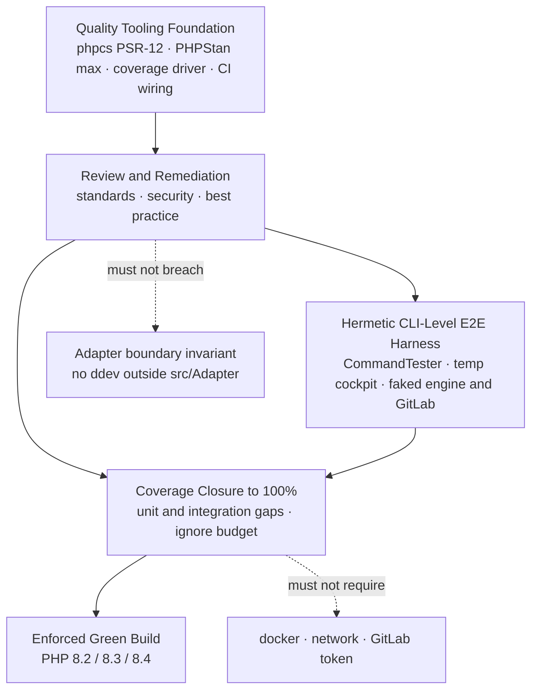
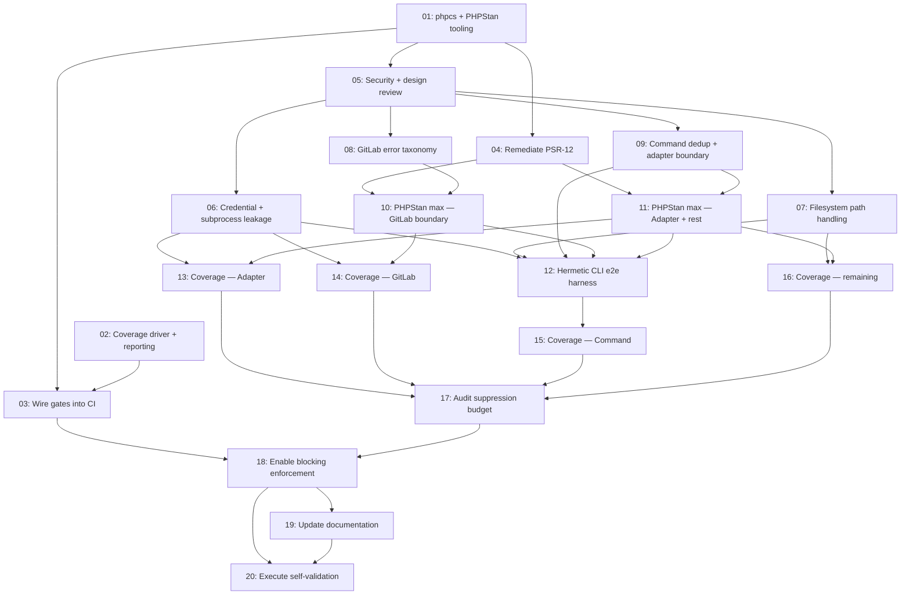

# Plan: Full Test Coverage and Code Review Remediation for upkeep

## Original Work Order

> 1. Ensure we have test coverage of everything in the upkeep project ./github.com/owenbush/upkeep. 2e2 if necessary.
> 2. Perform a code review checking for coding standards, security, and best practices. Remediate all issues.

## Plan Clarifications

| Question | Answer |
| --- | --- |
| What should "e2e if necessary" mean for the test suite? | CLI-level but hermetic: drive the console entry point via Symfony `CommandTester` against a temporary cockpit on disk, with the engine adapter and GitLab client still faked. No docker, no network. |
| Should coverage be measured and enforced, or closed by inspection? | Measured and enforced. Add a coverage driver and coverage configuration, enable coverage in CI, fail the build below the floor. |
| What line-coverage floor should CI enforce? | 100%, with an explicit `@codeCoverageIgnore` budget for genuinely unreachable lines. |
| Which ruleset defines "coding standards"? | PHP_CodeSniffer on PSR-12 plus PHPStan, both wired into CI. upkeep is a standalone Symfony Console library rather than Drupal code, so PSR-12 matches its actual idiom and its Symfony dependencies. |
| Which PHPStan level? | Level max. No baseline — existing violations are remediated, not deferred. |
| Is backwards compatibility required? | No. Nothing is published (the repository carries no release tags), so the CLI surface, command names, flags, exit codes, `registry.yml`, and the cached-results format are all changeable. |
| In what order should the two halves run? | Tooling first, then review and remediation, then the coverage push against the final shape of the code. |
| One plan or two? | One. The two work-order items share the tooling foundation, and remediation determines what the tests are ultimately written against. |

## Executive Summary

upkeep is a 99-file Symfony Console application with 47 test files and no
objective measure of how much of it is actually exercised. It has no static
analysis, no style linter, and CI that explicitly runs with `coverage: none`.
The suite is fast and hermetic by design — engine interactions run against
fakes of `Adapter\EngineAdapterInterface` and GitLab against mocked HTTP — and
that property is worth preserving, but it currently coexists with an unknown
quantity of untested and unanalysed code. This plan converts "we think it is
tested" into a mechanically enforced fact, and pairs that with a full review
and remediation pass across standards, security, and best practice.

The approach front-loads tooling. PHP_CodeSniffer (PSR-12), PHPStan (level
max), and a coverage driver are installed and wired into the existing PHP
8.2/8.3/8.4 CI matrix before any remediation begins, so that every subsequent
change is judged by machine rather than by eye. Review and remediation follow
while the code is still cheap to change — there are no backwards-compatibility
constraints, so design-level findings can be fixed properly rather than worked
around. Only then does the coverage push begin, against the final shape of the
code, which avoids writing the same tests twice.

The outcome is a repository where a green build is a meaningful signal: every
executable line is covered or explicitly and justifiably excluded, no PSR-12
violation or PHPStan-max error survives, and the security-sensitive paths —
GitLab token handling, subprocess invocation, and filesystem path resolution —
have been reviewed against named threats rather than reviewed in general.

## Context

### Current State vs Target State

| Current State | Target State | Why? |
| --- | --- | --- |
| No coverage measurement; `phpunit.xml.dist` declares a `<source>` block but produces no coverage report | Coverage driver installed, coverage report configured, 100% line coverage enforced | The work order asks for coverage "of everything"; without measurement that claim is unverifiable and silently regresses |
| CI runs `shivammathur/setup-php` with `coverage: none` | CI runs with a coverage driver enabled and fails the build below the floor | Enforcement has to live where it cannot be skipped |
| 55 of 99 source classes have no dedicated test file | Every class covered, whether directly or transitively, to the enforced floor | File-name matching understates real coverage but overstates confidence; the measured number replaces both |
| No static analysis tooling | PHPStan at level max, clean, no baseline | Catches null-handling, type, and array-shape defects that tests alone will not surface |
| No style linter; conventions enforced only by review | PHP_CodeSniffer on PSR-12, clean, running in CI | Style consistency currently depends on reviewer attention and will drift |
| Command wiring, argument parsing, and exit codes are exercised only where command classes are tested directly | Hermetic CLI-level tests drive commands end to end through `CommandTester` | The exit-code contract (0 pass / 1 check failed / 2 infrastructure) is a documented behaviour and deserves direct tests |
| `ProcessRunner` failure paths embed the full command line and combined output into `AdapterException` messages | Subprocess failure reporting reviewed and, if needed, redacted | If token material ever reaches an argument vector or child output, it propagates into exception text and logs, contradicting the "never log or print a token" rule |
| `TokenResolver` reads `~/.config/upkeep/drupal-pat` without inspecting its permissions | Credential file handling reviewed against a named threat model | A world-readable PAT file is a realistic local exposure the tool could detect |
| Security, standards, and best practice assessed ad hoc | A completed review with every finding either remediated or explicitly recorded as out of scope | The work order asks for remediation of all issues, which requires an enumerable finding set |

### Background

upkeep orchestrates maintenance of contributed Drupal modules: it provisions
throwaway environments, checks out merge requests from git.drupalcode.org, runs
checks, and assembles a dashboard. Its architecture rests on one hard
invariant, documented in `CLAUDE.md`: engine specifics — ddev,
ddev-drupal-contrib, docker, container and volume names — live only in
`src/Adapter/`, and the rest of the orchestrator talks to
`EngineAdapterInterface`. The guard is that `grep -r "ddev" src/
--exclude-dir=Adapter` returns nothing.

That invariant is what makes the current test suite fast and offline, and it
constrains this plan in both directions. Remediation must not breach it — a
refactor that leaks engine knowledge outward is a regression regardless of what
any linter says. Equally, the coverage push must not be tempted to reach for
real ddev execution to cover `Adapter\DdevContribAdapter`; that class is
covered through the adapter's own seams, not by running docker.

The repository is unreleased. There are no git tags, the working tree is clean,
and `main` carries three merged pull requests. The only other plan in this
workspace, `01--build-and-publish-upkeep-v1`, remains active in `plans/` rather
than archived, so publication has not yet happened. This is the reason
backwards compatibility was waived: there is no downstream consumer to break.
The one practical consequence is local — a change to `registry.yml` or the
cached-results format under `<cockpit>/results/` may require the maintainer's
own working cockpit to be rebuilt by hand.

Coverage at 100% combined with PHPStan at level max is a deliberately high bar
and was chosen with the tradeoff stated. The heaviest concentration of work is
expected in `src/Adapter/` (22 classes, subprocess orchestration) and
`src/Gitlab/` (13 classes, HTTP and error taxonomy), where dynamic return types
and unreachable defensive branches are most common.

## Architectural Approach

The work divides into four components with a strict ordering constraint: the
tooling component must complete before review and remediation, and remediation
must complete before the coverage closure component, because remediation is
free to change the class shapes that tests would otherwise be written against.
The e2e harness component is independent of remediation's outcome in structure
but not in detail, so it is built after remediation settles the CLI surface.



### Quality Tooling Foundation

**Objective**: Make correctness, style, and coverage machine-checked before any
code changes, so remediation is measured against a fixed standard rather than a
moving one.

Three dev dependencies are added: `squizlabs/php_codesniffer` configured for
PSR-12 over `src/`, `bin/`, and `tests/`; `phpstan/phpstan` configured at level
max over `src/` and `tests/`; and a coverage driver. PCOV is the preferred
driver because it is substantially faster than Xdebug and the enforced metric
is line coverage, which PCOV supports fully. The tradeoff is that PCOV cannot
produce branch or path coverage — if that is ever wanted, the driver must
change to Xdebug. Both are available through `shivammathur/setup-php` across
the existing 8.2/8.3/8.4 matrix.

`phpunit.xml.dist` gains coverage reporting and a minimum-line-coverage
requirement, so the enforcement lives in the same place developers run locally
rather than only in CI. The existing `failOnRisky` and `failOnWarning` settings
are retained. The CI workflow's `coverage: none` is replaced with the chosen
driver, and lint plus analysis steps are added alongside the existing PHPUnit
and binary smoke-test steps. Composer scripts are added so that the same
commands run identically in both places.

The tooling is introduced in a state where it reports failures without blocking
the remediation work that follows; enforcement is switched on as each category
reaches clean. This ordering matters — installing a level-max PHPStan as a
hard gate before remediation would block every intermediate commit.

### Review and Remediation

**Objective**: Produce an enumerable set of findings across standards,
security, and best practice, and resolve every one of them while the code
carries no compatibility obligations.

The review has three lenses applied across all 99 source files, plus `bin/upkeep`
and the test suite.

*Standards* is largely mechanical: PSR-12 violations reported by the sniffer,
and PHPStan-max errors. The expected concentrations are missing generic type
annotations on collections, insufficiently narrowed `mixed` from
`symfony/http-client` responses and `symfony/yaml` parsing, and null-handling
around `Process::getExitCode()`. Fixes are applied at the source rather than
suppressed; suppression annotations require a written justification and are
treated as findings in their own right.

*Security* is targeted at named threats rather than a generic sweep, and
concentrates on three areas. Credential handling: `Gitlab\TokenResolver`
resolves a PAT from `UPKEEP_GITLAB_TOKEN` or `~/.config/upkeep/drupal-pat` and
is documented as never printing or persisting it — the review verifies that
property holds across every path that touches the resolved value, including
error paths, and considers whether the tool should refuse or warn on a
world-readable credential file. Subprocess invocation: `Adapter\ProcessRunner`
builds `Symfony\Component\Process\Process` from list-form argument vectors,
which avoids shell interpolation by construction, but its failure path
interpolates `getCommandLine()` and the full combined child output into an
`AdapterException` message — the review establishes whether any caller can
place token material into either, and redacts if so. Filesystem handling: path
resolution for the cockpit and the projects root, which must stay under `$HOME`
for Docker mount reasons on macOS, is reviewed for traversal and symlink
handling, along with the permissions and atomicity of files written under
`<cockpit>/results/` and the base-artifact trees.

*Best practice* covers the design-level findings that the linters cannot see:
misplaced responsibilities, error-taxonomy consistency across the `Gitlab`
exception hierarchy, duplication between command classes, and any breach of the
adapter boundary. Because no backwards-compatibility constraint applies, these
are fixed structurally rather than papered over.

Every finding is recorded with its resolution. Findings deliberately not fixed
must be stated as such with a reason, so that "remediate all issues" has a
verifiable end state rather than an implied one.

### Hermetic CLI-Level E2E Harness

**Objective**: Cover command wiring, option parsing, and the exit-code contract
end to end, without acquiring a dependency on docker, the network, or a GitLab
token.

A reusable harness constructs the console application as `bin/upkeep` does,
against a temporary cockpit directory created per test and torn down after. The
engine is supplied as a fake implementing `EngineAdapterInterface`, and GitLab
via the existing mocked-HTTP approach, so the seams already relied upon by the
current suite are reused rather than duplicated. Tests drive commands through
Symfony's `CommandTester` and assert on rendered output and exit status.

The exit-code contract in `src/Workflow/` — 0 for pass, 1 for a failed check, 2
for infrastructure failure — is the primary target, since it is the tool's
machine-readable interface and is currently asserted only indirectly. Cockpit
resolution precedence (`--cockpit` over `UPKEEP_COCKPIT` over cwd) and projects-root
precedence (`--projects-root` over `UPKEEP_PROJECTS_ROOT` over `~/.upkeep/projects`)
are behaviours with three branches each and are covered here rather than in
isolation. The `--version` option, which selects the target Drupal core version
rather than reporting the application version, is covered explicitly because it
is a documented source of confusion.

These tests join the existing `unit` testsuite rather than forming a separate
one; there is no second suite to configure because nothing about them is slow
or environment-dependent.

### Coverage Closure to 100%

**Objective**: Reach and hold the enforced floor, honestly.

With remediation settled and the e2e harness in place, the coverage report
becomes the work list. The 55 classes currently lacking a dedicated test file
are the starting hypothesis, not the target list — many are enums, value
objects, and exception types that the report will show as already covered
transitively, while some classes that do have test files will show uncovered
branches. The measured report governs.

The risk specific to a 100% bar is that it can be satisfied dishonestly, either
by `@codeCoverageIgnore` applied liberally or by tests that execute lines
without asserting on behaviour. Both are treated as defects. Every ignore
annotation carries a comment justifying why the line is genuinely unreachable —
the legitimate cases being defensive branches against states the type system
already excludes, and platform paths that cannot occur on the CI matrix. The
ignore budget is reviewed as a whole at the end rather than accreted silently,
and its total size is reported.

Where a class proves untestable without contortion, the correct response is to
change the class — introduce a seam, inject a collaborator — not to lower the
bar or to write a test that asserts nothing. No-BC status makes this available
throughout.

## Risk Considerations and Mitigation Strategies

<details>
<summary>Technical Risks</summary>

- **100% line coverage is disproportionately expensive in the adapter layer**: `Adapter\DdevContribAdapter`, `ProcessRunner`, `VolumeProbe`, and `ThrowawaySite` orchestrate subprocesses and filesystem state, where defensive branches are common and some are genuinely unreachable under test.
    - **Mitigation**: Cover through the existing adapter seams and injected process abstractions rather than by executing real commands; use the justified `@codeCoverageIgnore` budget for the residue, and report its size explicitly rather than hiding it.
- **PHPStan level max against Symfony's dynamic return types**: `symfony/http-client` responses, `symfony/yaml` parsing, and `Process::getExitCode()` return loosely typed or nullable values that level max will flag extensively across `src/Gitlab/` and `src/Adapter/`.
    - **Mitigation**: Narrow at the boundary — decode and validate external input into typed value objects once, at the edge, so the interior of the codebase is statically clean without scattered assertions.
- **Coverage driver availability and cost across the 8.2/8.3/8.4 matrix**: enabling coverage triples nothing but does slow every matrix leg, and PCOV cannot produce branch coverage should that be wanted later.
    - **Mitigation**: Use PCOV for speed given the metric is line coverage; enforce the threshold on a single matrix leg while running the suite uncovered on the others if wall-clock becomes a problem, keeping the gate authoritative but not triplicated.
- **Enforcement introduced too early blocks its own remediation**: a hard level-max gate installed before the fixes would fail every intermediate commit.
    - **Mitigation**: Install the tooling in reporting mode and switch each category to blocking as it reaches clean.
</details>

<details>
<summary>Implementation Risks</summary>

- **No-BC freedom invites scope drift**: with the CLI surface, flags, and on-disk formats all changeable, "best practice" findings can expand into an open-ended redesign.
    - **Mitigation**: The PRE_PLAN scope rules still bind. A change qualifies only if it resolves a recorded review finding; anything else is noted for a future work order rather than absorbed here.
- **The adapter boundary is breached during refactoring**: a plausible-looking simplification that moves engine knowledge out of `src/Adapter/` would violate the project's central invariant, and no linter in this plan would catch it.
    - **Mitigation**: Treat the documented grep guard as a hard gate and run it as part of the validation set, not as a manual convention.
- **On-disk format changes strand the maintainer's working cockpit**: altering `registry.yml` or the `<cockpit>/results/` cache format silently invalidates existing local state.
    - **Mitigation**: Any such change is surfaced explicitly with the manual rebuild it implies, so the cost is a decision rather than a surprise.
- **Remediation proceeds without a complete safety net**: the ordering places the bulk of the code changes before coverage reaches 100%.
    - **Mitigation**: The existing 47 test files must stay green at every step, and the binary smoke test remains in CI throughout; the sequencing was chosen with this tradeoff explicitly accepted over the alternative cost of rewriting tests after refactoring.
</details>

<details>
<summary>Quality Risks</summary>

- **The 100% number is met without meaning**: coverage measures execution, not assertion, so a suite can reach the floor while verifying little.
    - **Mitigation**: Tests are reviewed for behavioural assertions, not line traversal; any test that executes a path without asserting an outcome is a finding.
- **Suppression replaces remediation**: `@phpstan-ignore`, `phpcs:ignore`, and `@codeCoverageIgnore` can each convert a real defect into a green build.
    - **Mitigation**: Every suppression requires a written justification and is itself reviewable; a baseline file was explicitly rejected during clarification for the same reason.
</details>

<details>
<summary>Security Risks</summary>

- **Token material reaching logs or exception text**: `ProcessRunner` embeds the full command line and combined child output into failure messages, and the log closure streams every child output line.
    - **Mitigation**: Trace every path by which a resolved PAT could enter an argument vector, an environment variable visible to a child, or child output; redact at the reporting boundary and cover the redaction with tests.
- **Credential file exposure**: the PAT is read from a plain file under the user's config directory with no permission check.
    - **Mitigation**: Assess during review whether to warn or refuse on overly permissive modes, and record the decision either way rather than leaving it implicit.
</details>

## Success Criteria

### Primary Success Criteria

1. `vendor/bin/phpunit` reports 100% line coverage over `src/` and fails if coverage drops below that floor.
2. `vendor/bin/phpstan analyse` at level max reports zero errors with no baseline file present.
3. `vendor/bin/phpcs` reports zero PSR-12 violations across `src/`, `bin/`, and `tests/`.
4. CI passes on PHP 8.2, 8.3, and 8.4 with lint, static analysis, coverage enforcement, and the binary smoke test all running.
5. Every review finding across standards, security, and best practice is recorded with its resolution; any finding not fixed is stated with an explicit reason.
6. The test suite still runs offline with no docker, no network, and no GitLab token, and completes in seconds.
7. `grep -r "ddev" src/ --exclude-dir=Adapter` returns nothing.
8. Hermetic CLI-level tests assert the 0/1/2 exit-code contract, cockpit resolution precedence, and projects-root resolution precedence through the console entry point.
9. Every `@codeCoverageIgnore`, `@phpstan-ignore`, and `phpcs:ignore` annotation carries a written justification, and the total count is reported.

## Self Validation

Execute these steps after all work is complete and record the output of each.

1. Run `composer install --no-interaction` in a clean checkout and confirm it succeeds with no unresolved dev dependencies.
2. Run `vendor/bin/phpunit --coverage-text` and confirm the summary reports 100% of lines for `src/`; capture the per-namespace table as evidence.
3. Deliberately delete or comment out one assertion-bearing test file, re-run `vendor/bin/phpunit`, and confirm the run **fails** on the coverage threshold — proving the gate is live rather than merely reported. Restore the file afterwards.
4. Run `vendor/bin/phpstan analyse --no-progress` and confirm zero errors; separately confirm no `phpstan-baseline.neon` exists in the repository.
5. Run `vendor/bin/phpcs` and confirm zero errors and zero warnings.
6. Run `grep -r "ddev" src/ --exclude-dir=Adapter` and confirm it produces no output.
7. Run `grep -rn "codeCoverageIgnore\|phpstan-ignore\|phpcs:ignore" src/` and confirm every hit has an adjacent justification comment; report the total count.
8. Run `./bin/upkeep list` and confirm every command registers and the binary exits 0.
9. Exercise the exit-code contract directly from the shell: invoke a command scenario that passes and confirm `$?` is 0, one where a check fails and confirm 1, and one with an infrastructure failure and confirm 2.
10. With `UPKEEP_GITLAB_TOKEN` set to a recognisable sentinel value, run the command paths that touch GitLab and force a subprocess failure, then grep the combined output and any written result files for the sentinel; confirm it appears nowhere.
11. Unset `UPKEEP_GITLAB_TOKEN` and confirm the tool reports the missing credential using `TokenResolver::describeSources()` wording without emitting token material.
12. Run the full suite with the network disabled and with docker stopped, confirming it still passes — proving the hermetic property survived.
13. Confirm the GitHub Actions run is green on all three matrix legs and that its log shows the lint, analysis, and coverage steps actually executing.

## Documentation

- **`CLAUDE.md`** — update the "Running tests" section to cover the new commands (lint, static analysis, coverage) and state the enforced coverage floor. Add the suppression-justification rule to "Conventions" so future work inherits it.
- **`README.md`** — update any contributor or development guidance to reflect the new quality gates. If remediation changes command names, flags, or exit codes, the user-facing command documentation must be updated to match.
- **`docs/contrib-maintainer-design.md`** — update if remediation alters architecture or the on-disk formats it describes.
- **`.github/workflows/ci.yml`** — the workflow is itself the documentation of the quality gates; its step names should make the four gates legible at a glance.
- If `registry.yml` or the cached-results format changes, document the manual rebuild required for an existing cockpit.

## Resource Requirements

### Development Skills

Modern PHP 8.2+ with strict types and readonly classes; Symfony Console,
Process, HttpClient, and Yaml components; PHPUnit 11 including test doubles and
coverage configuration; PHPStan at max level, particularly generics and array
shapes; PSR-12; and applied security review of credential handling, subprocess
invocation, and filesystem path resolution.

### Technical Infrastructure

PHP 8.2, 8.3, and 8.4; Composer; PHPUnit 11.5; PHP_CodeSniffer; PHPStan; PCOV
(or Xdebug) as the coverage driver; GitHub Actions with
`shivammathur/setup-php`. No docker, no network access, and no GitLab token are
required at any point — the absence of these is itself a success criterion.

### External Dependencies

None beyond Composer-installable dev packages. The pinned engine version
(ddev-drupal-contrib 1.1.5, in `Adapter\EngineAddOn`) is referenced by the code
under test but is never invoked by the suite.

## Integration Strategy

All four quality gates run in the existing CI workflow rather than in a new
one, extending the current `tests` job so a single status check continues to
represent the build. The same gates are exposed as Composer scripts so local
and CI invocations cannot drift apart. Coverage enforcement lives in
`phpunit.xml.dist` rather than in a CI flag, for the same reason.

## Notes

- The clarification loop recorded 100% coverage and PHPStan max as explicit
  maintainer choices. They are a deliberately high bar and the plan treats them
  as binding, but the honest reporting of the suppression budget is what keeps
  them meaningful — a green build with an unexamined ignore list would satisfy
  the letter of the criteria and none of the intent.
- The waiver of backwards compatibility rests on the repository being
  unreleased, which was verified from the absence of git tags. If a release is
  cut before this work completes, that premise expires and the BC question must
  be re-asked rather than assumed to still hold.
- Plan `01--build-and-publish-upkeep-v1` is still active in `plans/`. This plan
  does not depend on it, but the two touch overlapping ground — publication
  readiness and quality gates — and remediation that changes the CLI surface
  may affect what that plan publishes.
- Per PRE_PLAN, the body of this document above the Execution Blueprint is a
  requirements document only, with no tasks, phases, or estimates. The
  Execution Blueprint below was appended by the task-generation step.

## Execution Blueprint

**Validation Gates:**
- Reference: `/config/hooks/POST_PHASE.md`

### Dependency Diagram



### ✅ Phase 1: Tooling Foundation — completed
**Parallel Tasks:**
- ✔️ Task 001: Add PHP_CodeSniffer and PHPStan in reporting mode — `completed`
- ✔️ Task 002: Add coverage driver and PHPUnit coverage reporting — `completed`

**Verified baselines** (independently re-run, not taken from agent reports):
PSR-12 — 245 errors / 227 warnings in 60 files. PHPStan level max — 302 errors.
Coverage — 64.63% lines (2149/3325), 40.66% classes, 59.20% methods. PHPUnit —
377 tests / 1015 assertions passing.

### ✅ Phase 2: CI Wiring, Style Remediation, and Review — completed
**Parallel Tasks:**
- ✔️ Task 003: Wire quality gates into the CI workflow (depends on: 001, 002) — `completed`
- ✔️ Task 004: Remediate all PSR-12 violations (depends on: 001) — `completed`
- ✔️ Task 005: Conduct the security and best-practice review and produce the findings record (depends on: 001) — `completed`

**Verified**: PSR-12 245 errors + 227 warnings → **0/0, exit 0**, with zero
suppressions added (59 files changed). PHPUnit still 377 tests / 1015
assertions. Adapter boundary grep silent. `review-findings.md` written with
**55 findings** (25 security, 30 best-practice; 2 Critical).

**Unverifiable in this environment**: task 003's "green CI run on all three
matrix legs" criterion — there is no push access to GitHub here. Every workflow
command was instead run locally on PHP 8.4.24 and its exit code recorded.

### ✅ Phase 3: Findings Remediation — completed
**Executed serially, not in parallel** (deviation recorded below):
- ✔️ Task 006: Remediate credential handling and subprocess output leakage (depends on: 005) — `completed`
- ✔️ Task 007: Remediate filesystem path and result-file handling (depends on: 005) — `completed`
- ✔️ Task 008: Remediate GitLab error-taxonomy consistency (depends on: 005) — `completed`
- ✔️ Task 009: Remediate command-class duplication and adapter-boundary compliance (depends on: 005) — `completed`

**Deviation from the blueprint**: these four were planned as parallel. The
maintainer's D1/D2 rulings expanded task 9 into a full DI refactor plus a
CLI-wide exit-code contract, which put its file ownership in direct conflict
with 6, 7, and 8 (`ResultsCache`, `GitlabClient`, `CheckCommand`, and exception
call sites inside command classes). Running them concurrently would have
corrupted each other's edits, so they were serialized 6 → 7 → 8 → 9. Dependency
order was preserved throughout; only the parallelism was given up.

**Verified progression** (each independently re-run, not taken from agent reports):

| After task | PHPUnit | PHPStan | phpcs |
| --- | --- | --- | --- |
| baseline | 377 / 1015 | 302 | clean |
| 006 | 422 / 1109 | 296 | clean |
| 007 | 500 / 1272 | 289 | clean |
| 008 | 533 / 1409 | 284 | clean |
| 009 | **581 / 1525** | **243** | clean |

**Adapter boundary genuinely closed**: `grep -ri "ddev" src/ --exclude-dir=Adapter`
is now silent, where before it found ten references that the case-sensitive
guard missed. Engine construction exists only in
`Adapter\DdevContribAdapterFactory` and the `bin/upkeep` composition root.

Operator-visible changes are recorded in `BEHAVIOUR-CHANGES.md` (15 items) and
the binding rulings in `DECISIONS.md`. Task 019 must document all of them;
task 012 must assert the new behaviour, not the old.

### ✅ Phase 4: Static Analysis to Level Max — completed
**Parallel Tasks:**
- ✔️ Task 010: Reach PHPStan level max across the GitLab and configuration boundary (depends on: 004, 008) — `completed`
- ✔️ Task 011: Reach PHPStan level max across the adapter and remaining namespaces (depends on: 004, 009) — `completed`

**Verified**: `vendor/bin/phpstan analyse --no-progress` reports **`[OK] No errors`**,
exit 0 — down from 302 at the task 1 baseline. No `phpstan-baseline.neon` exists,
and `grep -rn "phpstan-ignore\|phpcs:ignore\|codeCoverageIgnore" src/ tests/ bin/`
returns **nothing**: every one of the 302 errors was fixed at the source, none
suppressed. PHPUnit 596 tests / 1607 assertions; phpcs clean.

**Boundary-narrowing pattern established**: `array<array-key, mixed>` in at the
edge, typed value object out — a payload wrapper for fields, a row-narrower for
collections, `mixed` never crossing inward. Realised as `Gitlab\ApiPayload`,
`Drupal\ApiPayload`, and `Adapter\EngineDescription`. Task 17 should consider
whether those three same-vocabulary readers want consolidating.

**Third live fatal found**: `Command\NotesCommand` was missing its
`GitlabClientFactory` import, so `upkeep notes` raised
`Error: Class "Upkeep\Command\GitlabClientFactory" not found` on **every**
invocation. It shipped that way because the class docblock declared it
"deliberately untested… verified live". Now fixed, imported, and pinned by a
hermetic test.

**Modelling change worth noting**: `Process::getExitCode()`'s nullable is no
longer flattened to `-1`. Every value in 0..255 is a status some command really
returns, so a sentinel is indistinguishable from a real result;
`CapturedProcess::$exitCode` is now `?int` and "no status" is never a pass.

### ✅ Phase 5: E2E Harness and Coverage Closure — completed
**Parallel Tasks:**
- ✔️ Task 012: Build the hermetic CLI e2e harness and cover the exit-code contract (depends on: 006, 007, 009, 010, 011) — `completed`
- ✔️ Task 013: Close coverage to 100% across the adapter namespace (depends on: 006, 011) — `completed`
- ✔️ Task 014: Close coverage to 100% across the GitLab namespace (depends on: 006, 010) — `completed`
- ✔️ Task 016: Close coverage to 100% across the remaining namespaces (depends on: 007, 011) — `completed`

**Verified**: 777 tests / 2156 assertions passing; PHPStan `[OK] No errors`;
phpcs clean; still **zero suppressions of any kind** repo-wide. Coverage
74.47% → **95.45% lines (3857/4041)**. Every class still below 100% is in
`src/Command/`, which is task 015's scope — tasks 013, 014, and 016 each closed
their namespaces completely.

**Seams introduced rather than bars lowered**: `Adapter\CommandRunner` (the
shell-out interface that made `DdevContribAdapter`'s 422 lines of orchestration
testable without docker), `BaseArtifactBuilder` taking an optional
`CommandRunner` (it was at 0/68 lines because it shelled out to a real
`composer create-project`), and `FileWriter`'s protected seam for simulating
short and refused writes. `AbstractMrCommand` gained an optional injected
`GitlabClient`, matching the seam six sibling commands already exposed — without
it `check`/`review` were unreachable end to end.

**Unreachable branches removed at source rather than suppressed**: an
unreachable `LogicException` arm in `runCheck()`'s dispatch, a `match` default
over a regex-constrained unit set, `PathGuard`'s structurally unreachable root
guard, and `RegistryEditor`'s unreachable `catch` (replaced by a `finally` that
also stops a failed commit leaving the temp file behind).

**Harness**: `tests/Support/CliHarness` builds the real Application as
`bin/upkeep` does and drives it through **argv** — deliberately not
`ApplicationTester`, which hardcodes `ArrayInput` and makes
`Application::doRun()` answer its `--version` probe, so `check widget 5
--version=9` would print the app version and exit 0 instead of selecting target
core 9.

### ✅ Phase 6: Command Coverage — completed
**Parallel Tasks:**
- ✔️ Task 015: Close coverage to 100% across the command namespace (depends on: 012) — `completed`

**Verified**, independently re-run from a fresh report:

```
Classes: 100.00% (110/110)
Methods: 100.00% (470/470)
Lines:   100.00% (4035/4035)
```

834 tests / 2353 assertions; PHPStan `[OK] No errors`; phpcs clean;
`./bin/upkeep list` exit 0. **`grep -rn "phpstan-ignore\|phpcs:ignore\|phpcs:disable\|codeCoverageIgnore" src/ tests/ bin/`
returns nothing** — the 100% bar was met with no suppression anywhere in the
repository.

Three genuinely unreachable branches were **deleted at source rather than
annotated**: `DashboardCommand`'s null-snapshot `continue` (unreachable because
`fetchModule()` returns `ModuleSnapshot|ApiFailure`), a dead `match` default over
a four-valued `localCell()`, and `ExecCommand`'s empty-argument guard, which the
console's `REQUIRED|IS_ARRAY` argument refuses before `perform()` runs — that
deletion is now guarded by a test asserting the refusal.

`GitlabClientFactory::authenticated()` collapsed three copies of
`new GitlabClient(HttpClient::create(), …)` into one covered site, which is how
`AbstractMrCommand` and `PatchesCommand` were closed without a network call.

### Phase 7: Suppression Audit
**Parallel Tasks:**
- Task 017: Audit and justify the suppression budget (depends on: 013, 014, 015, 016)

### Phase 8: Enforcement
**Parallel Tasks:**
- Task 018: Enable blocking enforcement of all quality gates (depends on: 003, 017)

### Phase 9: Documentation
**Parallel Tasks:**
- Task 019: Update project documentation for the new quality gates and any surface changes (depends on: 018)

### Phase 10: Validation
**Parallel Tasks:**
- Task 020: Execute the plan's self-validation procedure (depends on: 018, 019)

### Post-phase Actions

Run the validation gates in `/config/hooks/POST_PHASE.md` at the end of each
phase. Three project-specific invariants must hold after every phase, not only
at the end:

- `vendor/bin/phpunit` passes.
- `grep -r "ddev" src/ --exclude-dir=Adapter` returns nothing.
- The suite requires no docker, no network, and no GitLab token.

Note that the quality gates are deliberately non-blocking from Phase 2 until
Phase 8. That is intended — a level-max gate installed before remediation would
fail every intermediate commit — but it means a green CI run between those
phases does not imply lint and analysis are clean. Task 018 closes that window.

### Execution Summary
- Total Phases: 10
- Total Tasks: 20
